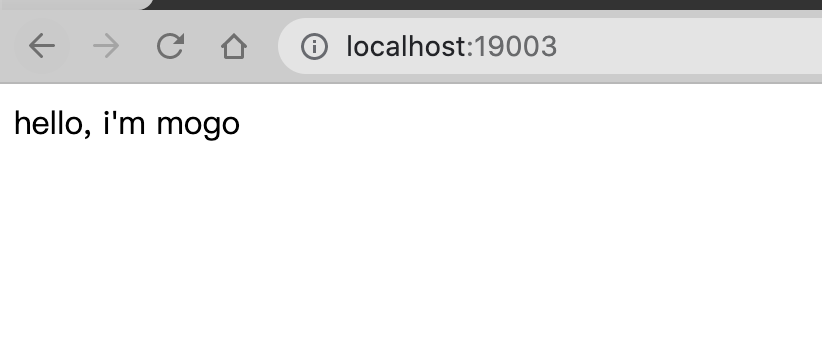

# 通过 docker-compose 体验 Mogo

本文主要介绍如何使用 docker-compose 在本地快速启动 Mogo demo，体验日志生成、采集、查询的完整流程。

## 1. 基本信息
- 项目地址：https://github.com/shimohq/mogo
- 浏览器输入 http://127.0.0.1:19001 访问 Mogo UI，账号/密码：shimo/shimo
- 浏览器输入 http://127.0.0.1:19002 查看 Kafka 数据消费详情
- 浏览器输入 http://127.0.0.1:19003 模拟真实用户访问 Nginx 写入 access 日志
- 13306 为 MySQL 的连接端口，账号/密码：root/shimo
- 8123 为 ClickHouse 的连接端口，账号/密码：root/shimo

## 2. 操作流程
### 2.1. 启动 Mogo
- 克隆 Mogo：git clone https://github.91chi.fun//https://github.com/shimohq/mogo.git
- 在 Mogo 项目的根目录下执行：docker-compose up
- 在浏览器里输入 http://127.0.0.1:19001，进入到 Mogo 登录页面，输入账号/密码：shimo/shimo

### 2.2. 创建数据库
创建实例，填写 dns 参数 tcp://clickhouse:9000?username=root&password=shimo&read_timeout=10&writer_timeout=10&debug=true

### 2.3. 创建日志
- 创建数据表：ingress_stdout
- 选择采集日志的时间类型，采集日志的标示必须位 _time_，类型支持 string 或者 float，在 demo 演示中必须选择  float 类型
- 日志保存时间：7 天
- Brokers：填入 docker-compose 启动的中的 Kafka 容器访问地址：kafka:9092
- Topic：Kafka 中采集日志的 topic name 是 ingress-stdout

### 2.4 模拟访问
打开浏览器并访问 http://127.0.0.1:19003，可看到页面输出 hello，i'm mogo，此时 Nginx 已产生一条 access 日志。

在浏览器中访问 http://localhost:19002/topics/ingress-stdout?o=-1&p=-1&q&s=50#messages，如可查到 Kafka 中日志内容，说明已经采集成功。随后再查看 consumers，可以看到 logger_ingress_stdout 这个消费组，说明 ClickHouse 正在消费。

### 2.5. 查看日志
访问 http://localhost:19001/query ，我们可以查询到刚产生的 Nginx Access 日志。

### 2.6. 增加索引
因为没有创建索引，所有字段的背景色都是灰色的，这种方式下是使用模糊搜索，性能不是很好，所以我们需要按照下图创建索引。

创建完索引后，我们再访问几次 http://127.0.0.1:19003，增加几条新的 access 日志后，就可以根据索引查询日志。

