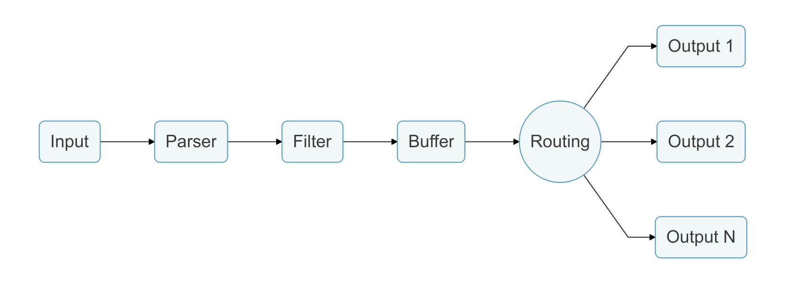

# Fluent-bit 配置参考

## 1. 环境准备

- Kubernetes 集群
- 已部署好 Mogo
- 已通过 DaemonSet 部署好 fluent-bit

先简单介绍下 fluent-bit 工作流程（[官方文档](https://docs.fluentbit.io/manual/v/1.0/getting_started)）：



日志通过数据管道从数据源发送到目的地，一个数据管道可以由 Input、Parser、Filter、Buffer、Routing、Output 等组成。

- Input 插件：用于从数据源抽取数据，一个数据管道中可以包含多个 Input。
- Parser 组件：负责将 Input 抽取的非结构化数据转化为标准的结构化数据，每个 Input 均可以定义自己的 Parser。
- Filter 插件：负责对格式化数据进行过滤和修改。一个数据管道中可以包含多个 Filter，多个 Filter 执行顺序与配置文件中的顺序一致。
- Buffer 组件：用户缓存经过 Filter 处理的数据，默认情况下Buffer把Input插件的数据缓存到内存中，直到路由传递到output为止。
- Routing 组件：将 Buffer 中缓存的数据路由到不同的 Output。
- Output 插件：负责将数据发送到不同的目的地，一个数据管道中可以包含多个 Output。

假设你是采用的 DaemonSet 方式部署 Fluent-bit，你的目标是采集 Kubernetes 集群的 Nginx Ingress 日志和业务标准输出日志，那么你可以参考如下样例来配置你的 Fluent-bit。

你可以通过 mogo 的可视化配置界面来对 Fluent-bit 进行配置的删改，具体操作方法是：点击顶部导航栏，选择 **配置**。然后在页面中两个联动选择器中选择已部署 **Fluent-bit 的集群 / 命名空间 / ConfigMap**。如还未录入集群数据，可以参考 [系统配置](https://mogo.shimo.im/doc/AWHIVJKJABTK6) 进行录入。

下图是选择 `xxx-dev` 集群下的 `kube-system` 命名空间下 `fluent-bit-config` 这个 ConfigMap 来进行更新。


点击配置编辑区域上方『开始编辑』按钮，即编辑配置文件，编辑完成后，点击『保存』按钮，随后点击左侧按钮，选择指定配置文件和版本之后，点击『发布』按钮，即可将配置同步至 ConfigMap。修改 ConfigMap 配置后，重启 fluent-bit 生效。

## 2. 配置说明

假设你是采用的 DaemonSet 方式部署 Fluent-bit，如果你希望采集 Kubernetes 集群的 Nginx Ingress 日志和业务标准输出日志，那么你可以参考如下样例来配置你的 Fluent-bit。

### 2.1. fluent-bit.conf 配置

`flient-bit.conf` 存储层配置全局环境配置。

```
[SERVICE]
    # 刷新output输出的时间间隔，单位秒
    Flush         1
　　 # 日志级别，可设置为(error/warning/info/debug/trace)
    Log_Level     info
　　 # 是否守护运行
    Daemon        off
    # 指定配置parse的配置文件
    Parsers_File  parsers.conf
    # 是否启动HTTP Server
    HTTP_Server   On
　　 # HTTP Server 监听Host
    HTTP_Listen   0.0.0.0
    # HTTP Server 监听Port
    HTTP_Port     2020

# 引用 input-kubernetes.conf
@INCLUDE input-kubernetes.conf
# 引用 filter-kubernetes.conf
@INCLUDE filter-kubernetes.conf
# 引用 filter-modify.conf
@INCLUDE filter-modify.conf
# 引用 output-kafka.conf
@INCLUDE output-kafka.conf 
```

### 2.2. parse.conf 配置

`parse.conf` 配置了解析 INPUT 的 parser，Parse 组件主要是将非结构化消息转换为结构化消息。

```
[PARSER]
    Name   nginx
    Format regex
    Regex ^(?<remote>[^ ]*) (?<host>[^ ]*) (?<user>[^ ]*) \[(?<time>[^\]]*)\] "(?<method>\S+)(?: +(?<path>[^\"]*?)(?: +\S*)?)?" (?<code>[^ ]*) (?<size>[^ ]*)(?: "(?<referer>[^\"]*)" "(?<agent>[^\"]*)")?$
    Time_Key time
    Time_Format %d/%b/%Y:%H:%M:%S %z

[PARSER]
    Name   json
    Format json
    Time_Key time
    Time_Format %d/%b/%Y:%H:%M:%S %z

[PARSER]
    Name        docker
    Format      json
    Time_Key    time
    Time_Format %Y-%m-%dT%H:%M:%S.%L
    Time_Keep   On
    # 与FILTER 阶段中Merge_Log=On 效果类似，解析log字段的json内容，但无法提到根层级
    #Decode_Field_As escaped_utf8 kubernetes do_next
    #Decode_Field_As json kubernetes

[PARSER]
    # http://rubular.com/r/tjUt3Awgg4
    Name cri
    Format regex
    Regex ^(?<time>[^ ]+) (?<stream>stdout|stderr) (?<logtag>[^ ]*) (?<message>.*)$
    Time_Key    time
    Time_Format %Y-%m-%dT%H:%M:%S.%L%z

[PARSER]
    Name        syslog
    Format      regex
    Regex       ^\<(?<pri>[0-9]+)\>(?<time>[^ ]* {1,2}[^ ]* [^ ]*) (?<host>[^ ]*) (?<ident>[a-zA-Z0-9_\/\.\-]*)(?:\[(?<pid>[0-9]+)\])?(?:[^\:]*\:)? *(?<message>.*)$
    Time_Key    time
    Time_Format %b %d %H:%M:%S
```

### 2.3. input-kubernetes.conf 配置

`input-kubernetes.conf` 配置 fluent-bit 具体采集哪些日志（Nginx Ingress、业务标准输出日志、节点系统日志等），以及采集的具体参数。

```
# 采集ingress access日志，目前不区分access和error日志，后面通过filter插件分离
[INPUT]
    # 使用 tail 插件
    Name              tail
    # Tag 标识数据源，用于后续处理流程Filter,output时选择数据
    Tag               ingress.*
    # Nginx Ingress 日志采集路径
    Path              /var/log/containers/nginx-ingress-controller*.log
    # 使用 docker parser
    Parser            docker
    # 指定监控的文件名及offsets持久化的数据库
    DB                /var/log/flb_ingress.db
    # 指定tail插件使用的最大内存，如果达到限制，插件会停止采集，刷新数据后会恢复
    Mem_Buf_Limit     15MB
    # 初始buffer size
    Buffer_Chunk_Size 32k
    # 每个文件的最大buffer size
    Buffer_Max_Size   64k
    # 跳过长度大于 Buffer_Max_Size 的行，Skip_Long_Lines 若设为Off遇到超过长度的行会停止采集        
    Skip_Long_Lines   On
    # 监控日志文件 refresh 间隔
    Refresh_Interval  10
    # 采集文件没有数据库偏移位置记录的，从文件的头部开始读取，日志文件较大时会导致fluent内存占用率升高出现oomkill
    #Read_from_Head    On

# 采集ingress error日志，目前不区分access和error日志，后面通过filter插件分离
[INPUT]
    Name              tail
    Tag               ingress_stderr.*
    Path              /var/log/containers/nginx-ingress-controller*.log
    Parser            docker
    DB                /var/log/flb_ingress_stderr.db
    Mem_Buf_Limit     15MB
    Buffer_Chunk_Size 32k
    Buffer_Max_Size   64k
    Skip_Long_Lines   On
    Refresh_Interval  10
    #Read_from_Head    On

# 采集容器stdout、stderr日志
[INPUT]
    Name              tail
    Tag               kube.*
    Path              /var/log/containers/*.log
    Exclude_path     *fluent-bit-*,*mongo-*,*minio-*,*mysql-*
    Parser            docker
    DB                /var/log/flb_kube.db
    Mem_Buf_Limit     15MB
    Buffer_Chunk_Size 1MB
    Buffer_Max_Size   5MB
    Skip_Long_Lines   On
    Refresh_Interval  10
```

### 2.4. filter-kubernetes.conf 配置

`filter-kubernetes.conf` 主要在 Kubernetes 环境下对采集的日志追加 Kubernetes 元数据，比如 `kubernetes_host`、`kubernetes_namespace_name`、`kubernetes_container_name`、`kubernetes_pod_name` 等。

```
[FILTER]
    # 使用kubernetes过滤器
    Name                kubernetes
    # 匹配ingress.*这个Tag对应的 INPUT
    Match               ingress.*
    # kubernetes API Server 地址
    Kube_URL            https://kubernetes.default.svc:443
    # kubernetes 上serviceAccount的CA证书路径
    Kube_CA_File        /var/run/secrets/kubernetes.io/serviceaccount/ca.crt
    # kubernetes 上serviceAccount的token路径
    Kube_Token_File     /var/run/secrets/kubernetes.io/serviceaccount/token
    # 当源日志来自tail插件，这个配置用于指定tail插件使用的前缀值
    Kube_Tag_Prefix     ingress.var.log.containers.
    # Merge_Log=On 解析log字段的json内容，提取到根层级, 附加到Merge_Log_Key指定的字段上
    Merge_Log           Off
    # 合并log字段后是否保持原始log字段
    Keep_Log            Off
    # 允许Kubernetes Pod 建议预定义的解析器
    K8S-Logging.Parser  Off
    # 允许Kubernetes Pod 从日志处理器中排除其日志
    K8S-Logging.Exclude Off
    # 是否在额外的元数据中包含 Kubernetes 资源标签信息
    Labels              Off
    # 是否在额外的元数据中包括 Kubernetes 资源信息
    Annotations         Off

[FILTER]
    Name                kubernetes
    Match               ingress_stderr.*
    Kube_URL            https://kubernetes.default.svc:443
    Kube_CA_File        /var/run/secrets/kubernetes.io/serviceaccount/ca.crt
    Kube_Token_File     /var/run/secrets/kubernetes.io/serviceaccount/token
    Kube_Tag_Prefix     ingress_stderr.var.log.containers.
    Merge_Log           Off
    Keep_Log            Off
    K8S-Logging.Parser  Off
    K8S-Logging.Exclude Off
    Labels              Off
    Annotations         Off

[FILTER]
    Name                kubernetes
    Match               kube.*
    Kube_URL            https://kubernetes.default.svc:443
    Kube_CA_File        /var/run/secrets/kubernetes.io/serviceaccount/ca.crt
    Kube_Token_File     /var/run/secrets/kubernetes.io/serviceaccount/token
    Kube_Tag_Prefix     kube.var.log.containers.
    Merge_Log           Off
    Keep_Log            Off
    K8S-Logging.Parser  Off
    K8S-Logging.Exclude Off
    Labels              Off
    Annotations         Off
```

### 2.5. filter-modify.conf 配置

`filter-modify.conf` 主要是修改和调整日志字段。

```
# nest过滤器此处主要是对包含pod_name的日志，在其字段中追加kubernetes_前缀
[FILTER]
    Name         nest
    Match        *
    Wildcard     pod_name
    Operation    lift
    Nested_under kubernetes
    Add_prefix   kubernetes_

# modify过滤器此处主要是调整部分kubernetes元数据字段名，同时追加一些额外的字段
[FILTER]
    # 使用modify过滤器
    Name            modify
    # 匹配所有INPUT
    Match           *
    # 将stream字段重命名为_source_
    Rename          stream _source_
    # 将log字段重命名为_log_
    Rename          log _log_
    # 将kubernetes_host字段重命名为_node_name_
    Rename          kubernetes_host _node_name_
    # 将kubernetes_namespace_name字段重命名为_namespace_
    Rename          kubernetes_namespace_name _namespace_
    # 将kubernetes_container_name字段重命名为_container_name_
    Rename          kubernetes_container_name _container_name_
    # 将kubernetes_pod_name字段重命名为_pod_name_
    Rename          kubernetes_pod_name _pod_name_
    # 移除所有匹配kubernetes_的字段
    Remove_wildcard kubernetes_
    # 追加_cluster_配置，其值为fluent-bit daemonset中配置的CLUSTER_NAME环境变量
    Add             _cluster_ ${CLUSTER_NAME}
    # 追加_log_agent_配置，其值为fluent-bit daemonset中配置的HOSTNAME环境变量
    Add             _log_agent_ ${HOSTNAME}
    # 追加_node_ip_配置，其值为fluent-bit daemonset中配置的NODE_IP环境变量
    Add             _node_ip_ ${NODE_IP}

# grep过滤器此处是对ingress.*这个INPUT进行过滤，排除包含"stderr"的原始日志，以保证所有日志均是access
[FILTER]
    Name    grep
    Match   ingress.*
    Exclude _source_ ^stderr$

# grep过滤器此处是对ingress_stderr.*这个INPUT进行过滤，排除包含"stdout"的原始日志，以保证所有日志均是stderr
[FILTER]
    Name    grep
    Match   ingress_stderr.*
    Exclude _source_ ^stdout$
```

### 2.6. output-kafka.conf 配置

`output-kafka.conf` 主要定义日志如何推送到 Kafka。

```
# 此处kafka output插件将Nginx Ingress access日志推送到Kafka
[OUTPUT]
    # 使用kafka插件
    Name              kafka
    # 匹配Nginx access日志
    Match             ingress.*
    # 指定Kafka Brokers地址
    Brokers           ${KAFKA_BROKERS}
    # 指定Kafka topic，如果需要推送到多个topic，多个topic通过','分隔
    Topics            ingress-stdout-logs-${CLUSTER_NAME}
    # 将Timestamp_Key设置为_time_，原默认值为@timestamp
    Timestamp_Key     _time_
    # 指定时间戳转成成的时间字符串格式
    Timestamp_Format  iso8601
    # 设置为false表示不限制重试次数
    Retry_Limit       false
    # 当kafka结束空闲连接时，隐藏"Receive failed: Disconnected"报错
    rdkafka.log.connection.close false
    # Kafka生产者队列中总消息容量最大值，此处设置为10MB，producer buffer is not included in http://fluentbit.io/documentation/0.12/configuration/memory_usage.html#estimating
    rdkafka.queue.buffering.max.kbytes 10240
    # Kafka生产者在leader已成功收到的数据并得到确认后才发送下一条message。
    rdkafka.request.required.acks 1

[OUTPUT]
    Name              kafka
    Match             ingress_stderr.*
    Brokers           ${KAFKA_BROKERS}
    Topics            ingress-stderr-logs-${CLUSTER_NAME}
    Timestamp_Key     _time_
    Timestamp_Format  iso8601
    Retry_Limit       false
    rdkafka.log.connection.close false
    rdkafka.queue.buffering.max.kbytes 10240
    rdkafka.request.required.acks 1

[OUTPUT]
    Name              kafka
    Match             kube.*
    Brokers           ${KAFKA_BROKERS}
    Topics            app-stdout-logs-${CLUSTER_NAME}
    Timestamp_Key     _time_
    Timestamp_Format  iso8601        
    Retry_Limit       false
    rdkafka.log.connection.close false
    rdkafka.queue.buffering.max.kbytes 10240
    rdkafka.request.required.acks 1
```